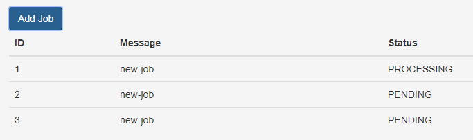

= spring_mvc_async_status demo

Add jobs and poll status using a Java task executor.

Start the application and navigate to port `8080/#/status` to add jobs for processing.

[caption=""]

== Dependencies

1. Node.js
2. Maven

== Running

Run with Maven:

    mvn spring-boot:run

== Discussion

The relevant classes are:

* StatusResource: the rest controller

* StatusQueueService: handles the tasking

* StatusJob: a "long-running" method entry-point

* StatusExecutorConfiguration: simple executor config.

Most of the other classes are generated by JHipster,
and can be safely ignored.

The client-side code is under `entities/status`

== Ideas for Future Development

* Add a "progress-bar" for the client

* Migrate the execute-and-wait to submit and poll status

** As an aside, I intentionally designed the queue class to be blocking,
   it would be nice to decouple the wait so that I can provide more info to the user
 
* Add a cron-job to clean-up "stale" jobs that could be 
  leftover from exceptions or cancellations
